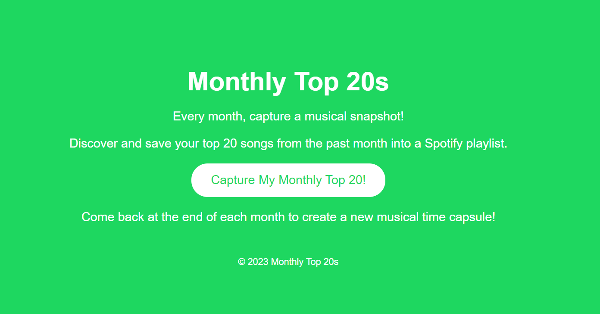
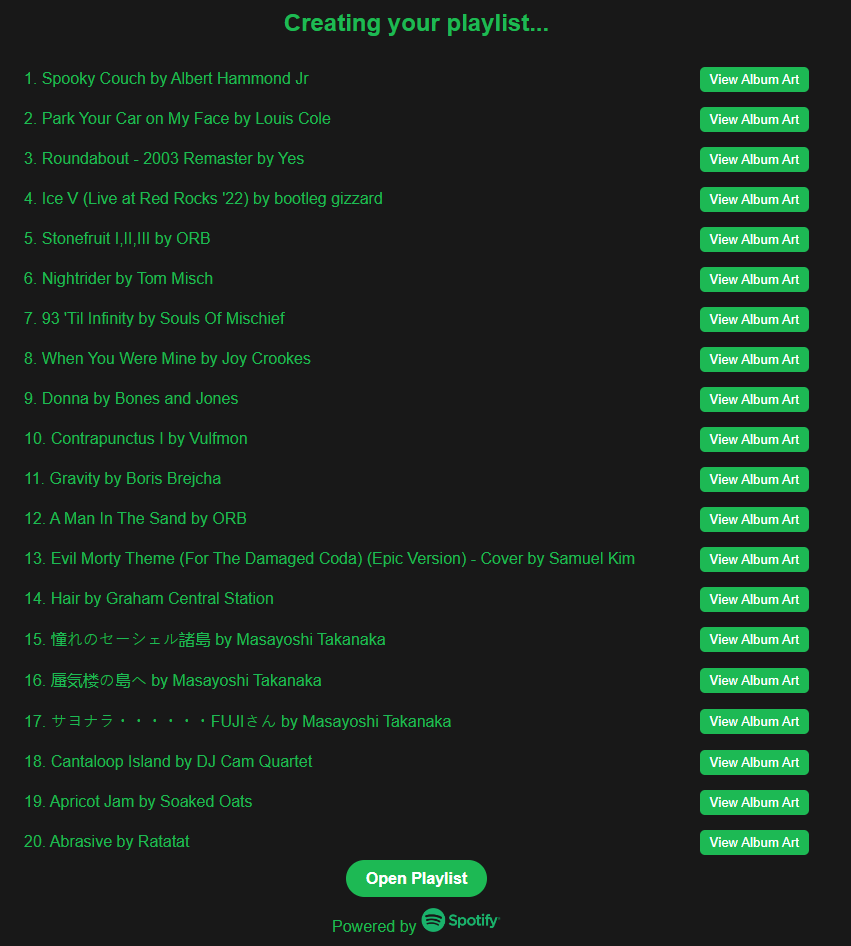
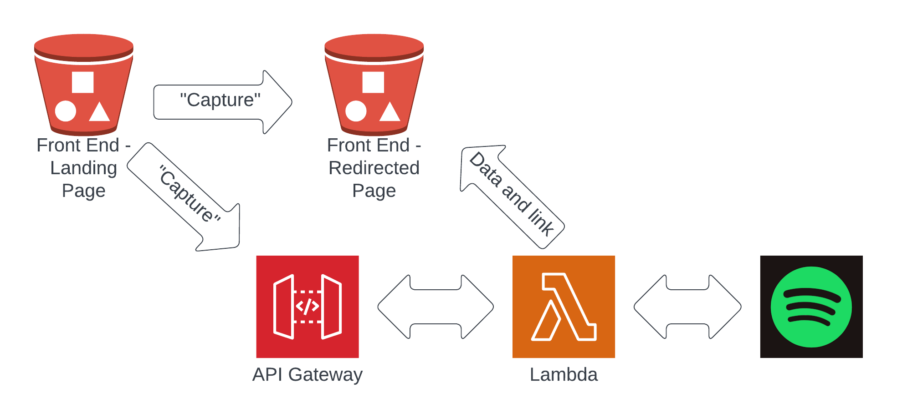

# SpotifyMonthlyPlaylist

A simple web app to create a playlist from a user's most played songs.

## To do list / feature roadmap

1. embed diagram in readme
2. print artist next to song title
3. add date to title
4. add ability to customise number (Top 10, Top 30)
5. add ability to customise time frame (top ever, last 6 months, last 4 weeks) with descriptions
6. donation link if it gets any traction
7. add functionality to automate users monthly and store refresh tokens securely.

## End points for testing only

Static s3 endpoint: <http://spotify-redirect-page.s3-website-ap-southeast-2.amazonaws.com>

Testing: <https://accounts.spotify.com/authorize?client_id=d226cb1348484b019d632c263a4bc270&response_type=code&redirect_uri=http://spotify-redirect-page.s3-website-ap-southeast-2.amazonaws.com&scope=playlist-modify-public%20user-top-read>

Spotify auth flow: <https://developer.spotify.com/documentation/web-api/tutorials/code-flow>

Front end: <http://my-top-20s.s3-website-ap-southeast-2.amazonaws.com/>

## Front end

## Results

## Architecture

